# Notes:
- This project is part of a database course.
- This project was done with two others. My work was focused on the planning phases (E-R diagrams, schema planning), front-end work and SQL queries, as well as parts of the application documentation seen below in the rest of the README.

# Create Table and Data Script
Found in vManage-create-insert.sql file

# Project Description
vManage is an application intended for helping high school sports organizers with keeping track of all the logistics, participants and other entities involved in organizing high school volleyball tournaments. With this application, organizers can keep track of all the tournaments they've hosted, the matches in each tournament, and teams and players that registered for said tournaments. Organizers can also see other important information, such as a list of teams that have enough players for a tournament.

From a business perspective, this allows organizers to step away from traditional spreadsheet style organizing methods which are more error prone and requires more time to process information. By having this application, organizers can save time and have a common interface to view information without relying on collaboration-based software like Google Sheets.

# Changes Made
## Cut Deliverables
Initially, we were going to involve every relation in our database in our application. However, due to time constraints, we were only able to implement functionality around our tournament, match, players and team data. This meant that sponsor, venue, referee and school records received no interactability in the application. Consequentially, many of the other features we planned to add (assigning referees to certain matches taking into account their schedules, tracking sponsors, etc.) did not make it into the final version.

Although we planned to have create/read/update/delete operations for all relations, even the ones that have been touched upon in the application are have no functionality regarding these operations. As such, only tournament rosters for a team have full CRUD functionality. However, matches, players and teams can at least still be read. 

## Schema
- Added jerseyNumber to Registers table as an extra attribute.
- Renamed Match to TournamentMatch to prevent naming a relation after a SQL keyword.
- Merged PlaysIn relation into TournamentMatch in order to more easily keep track of which teams played in a match compared to before. This affects the ER diagram by changing the PlaysIn relation into two relationships, one for each team FK attribute in TournamentMatch.
  - team_id from PlaysIn converted into team_id1 and team_id2.
  - score from PlaysIn converted into score1 and score2.
- Created a tournamentId attribute for Tournament and matchId attribute for TournamentMatch for better indexing, modifying the following relations:
  - Tournament (tournamentId is new PK)
  - TournamentMatch (matchId is new PK)
  - Referees (changed Tournament FK to tournament_id, which refers to tournamentId)
  - Sponsors (changed Tournament FK to tournament_id, which refers to tournamentId)
  - Registers (changed Tournament FK to tournament_id, which refers to tournamentId)
- Changed PK for Sponsors into sponsorsId so that the same sponsor can sponsor multiple times for 1 tournament.
- Because Tournament would be deletable, added ON DELETE CASCADE to:
  - Sponsors (Tournament deleted)
  - Registers (Tournament deleted)
  - Referees (Tournament deleted)
- Sponsors table now has a sponsorsId column as a placeholder PK attribute in order to allow the same sponsor to sponsor the same tournament multiple times.
- Gave Player the "eligible" attribute which is only used for filtering purposes when getting players to add to a team. It basically tells the user if the player is eligible to participate in vManage tournaments.
- Changed Player's playerId attribute to a SERIAL for easier insertion purposes and id retrieval.

# List of SQL Queries
```sql
    -- Insert Query
    INSERT INTO Player (height, firstName, lastName, dateOfBirth, eligible) 
    VALUES ($1, $2, $3, $4, TRUE) RETURNING playerId;

    -- Delete Query
    DELETE FROM Registers 
    WHERE tournament_id = $1 AND player_id = $2 AND team_id = $3;

    -- Update Query
    UPDATE Player P 
    SET height = $2, firstName = $3, lastName = $4, dateOfBirth = $5, eligible = $6 
    WHERE P.playerId = $1;

    -- Selection
    SELECT T.year, T.title, M.starttime, M.endtime, M.stage, 
      T1.name AS team1, M.score1, M.score2, T2.name AS team2 
    FROM TournamentMatch M, Team T1, Team T2, Tournament T 
    WHERE $1 <= M.startTime
        AND M.endTime::date <= $2
        AND T1.teamId = M.team_id1
        AND T2.teamId = M.team_id2
        AND T.tournamentId = M.tournament_id 
    ORDER BY M.starttime;

    -- Projection
    SELECT teamId, name, phoneNumber, emailAddress FROM Team;

    -- Join
    SELECT DISTINCT TR.tournamentId, TR.title, TR.startDate 
    FROM Team T, Registers R, Tournament TR 
    WHERE T.teamId = $1 AND T.teamId = R.team_id AND TR.tournamentId = R.tournament_id 
    ORDER BY TR.startDate;

    -- Aggregation with Group By
    SELECT tournamentId, title, year, startDate, endDate, COUNT(DISTINCT R.team_id) AS teamsCount 
    FROM Tournament T, Registers R 
    WHERE T.tournamentId = R.tournament_id 
    GROUP BY tournamentId, title, year, startDate, endDate 
    UNION 
    SELECT tournamentId, title, year, startDate, endDate, 0 AS teamsCount 
    FROM Tournament T 
    WHERE T.tournamentId NOT IN (SELECT R.tournament_id FROM Registers R) 
    ORDER BY startDate;

    -- Aggregation with Having
    SELECT teamId, name, phoneNumber, emailAddress 
    FROM Team 
    WHERE teamId IN (SELECT team_id 
                    FROM Registers 
                    WHERE tournament_id = $1 
                    GROUP BY team_id 
                    HAVING COUNT(*) >= 6);

    -- Nested Aggregation with Group By
    SELECT DISTINCT R.team_id 
    FROM Registers R 
    GROUP BY R.team_id 
    HAVING COUNT(DISTINCT(R.tournament_id)) >= ALL (SELECT COUNT(DISTINCT R.tournament_id) 
                                                    FROM Registers R 
                                                    GROUP BY R.team_id);

    -- Division
    SELECT P.firstName, P.lastName, P.height, P.dateOfBirth 
    FROM Player P 
    WHERE NOT EXISTS ((SELECT T.tournamentId 
                      FROM Tournament T 
                      WHERE T.tournamentId = ANY($1::int[]))
                        EXCEPT 
                      (SELECT R.tournament_id 
                      FROM Registers R 
                      WHERE R.player_id = P.playerId));
```
# Query Screenshots
## Insert
Inserting a new player into a team’s roster for a tournament
### Before

### Process
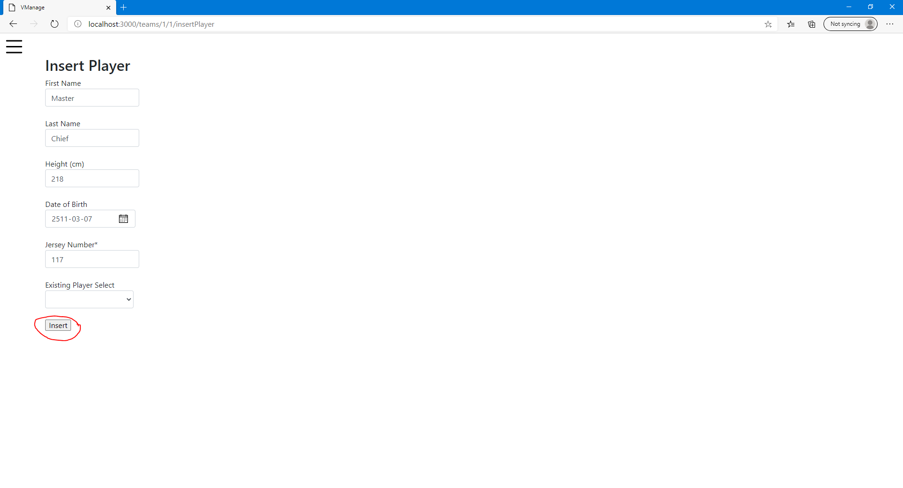
### After
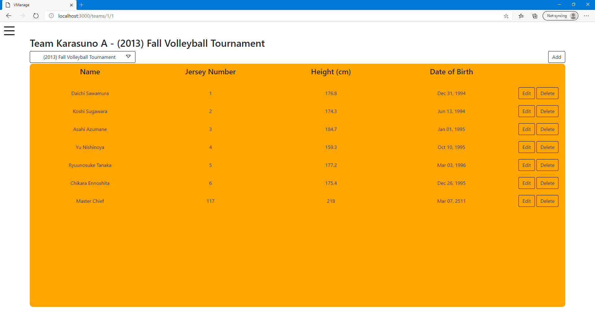

## Delete
Remove a player from a team’s roster for a tournament
### Before
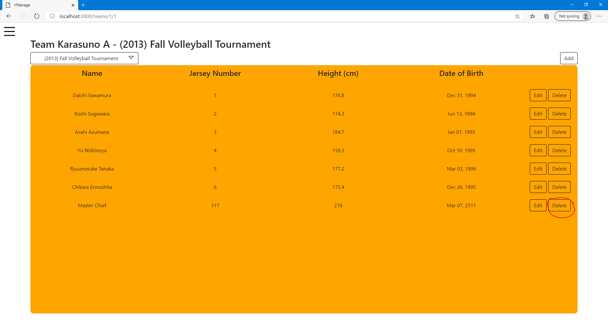
### After
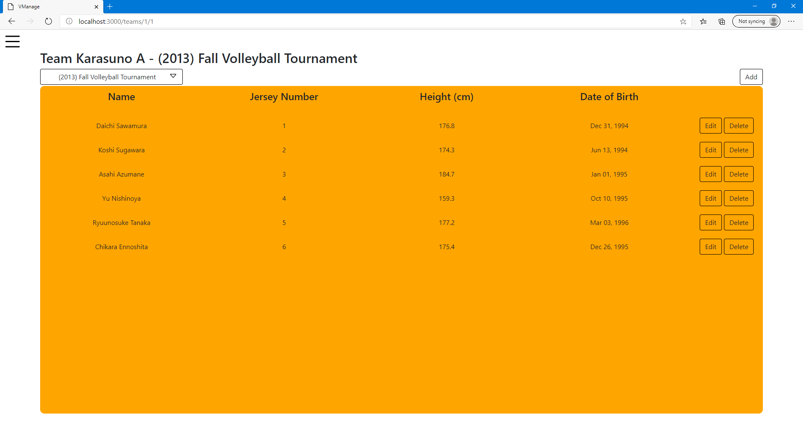

## Update
Update an existing player's information
### Before
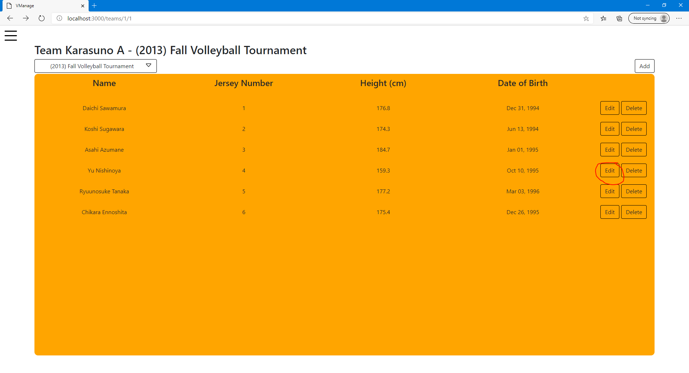
### Process
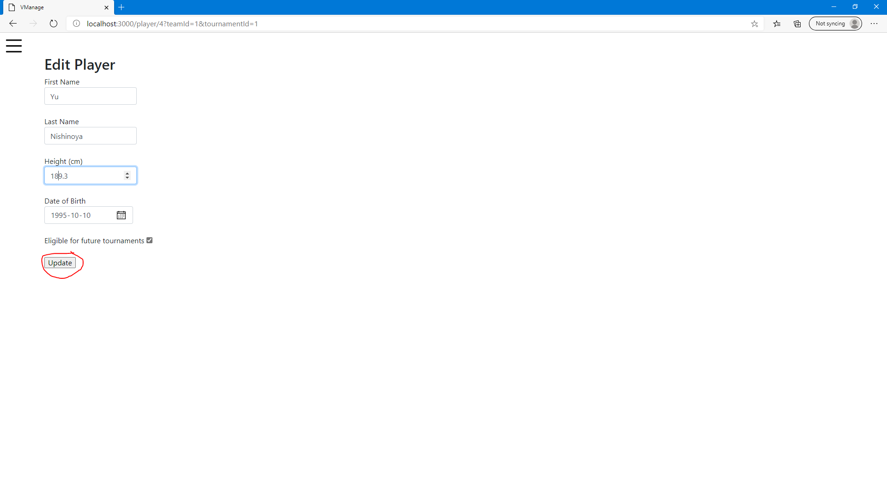
### After


## Selection
Get all matches that occurs between the selected dates
### Before
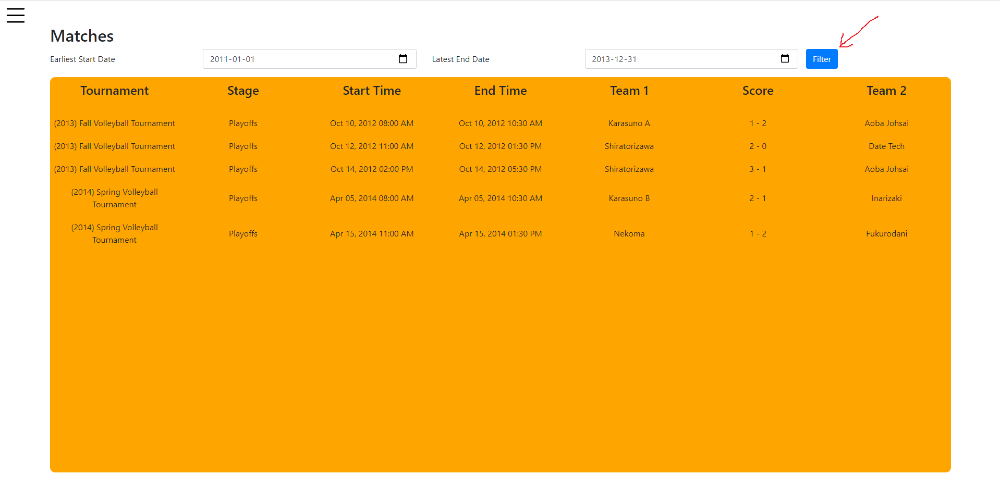
### After
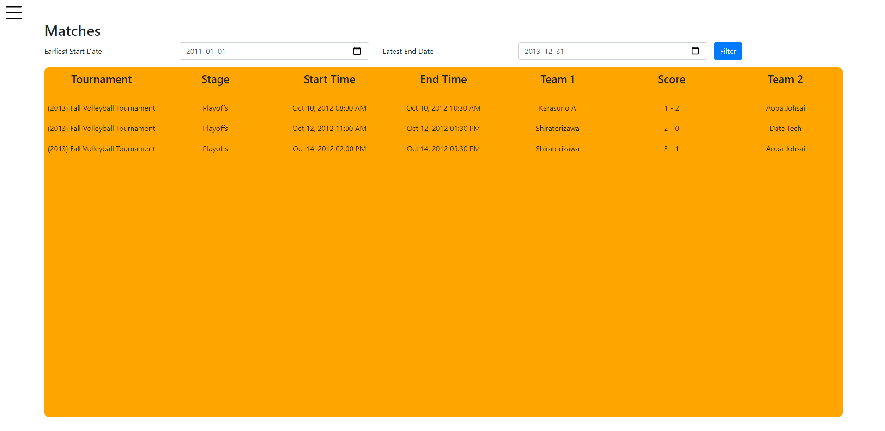

## Projection
Get a list of teams and some of their attributes
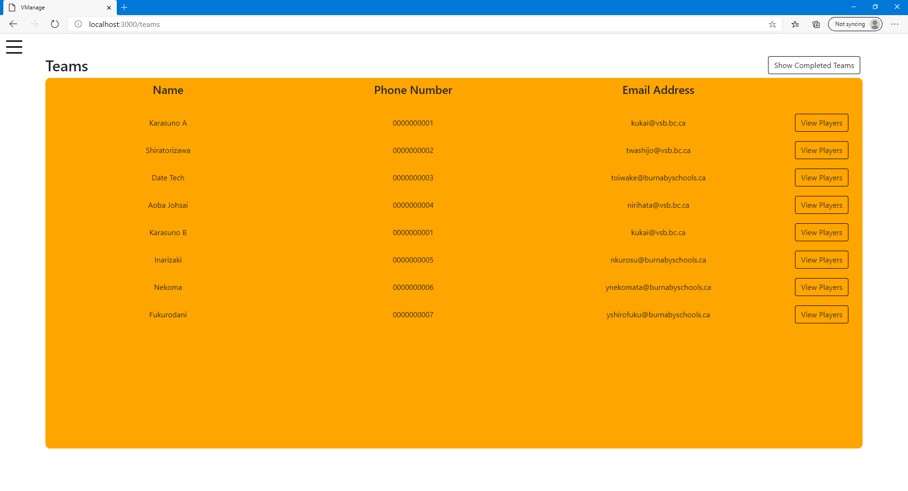

## Join
Get all tournaments that the current team has participated in
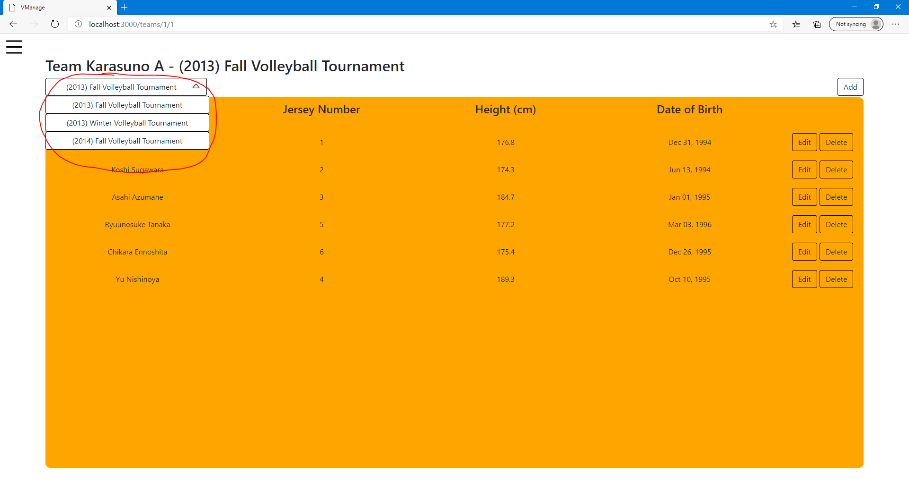

## Aggregation with Group By
Get the tournaments list along with how many teams participating in it
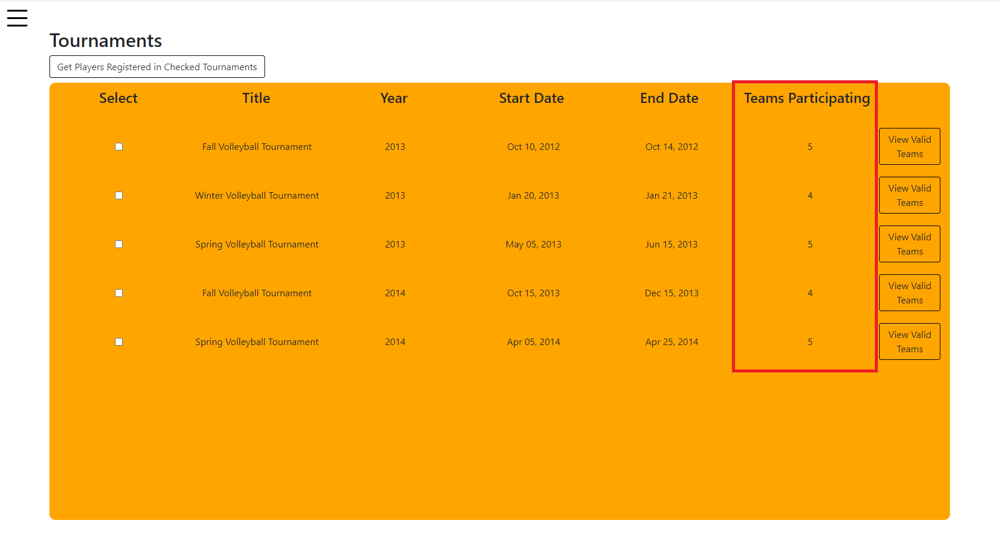

## Aggregation with Having
Show completed teams (> 6 players) for a given tournament
### After clicking "View Valid Teams" above for "Fall Volleyball Tournament", 2013
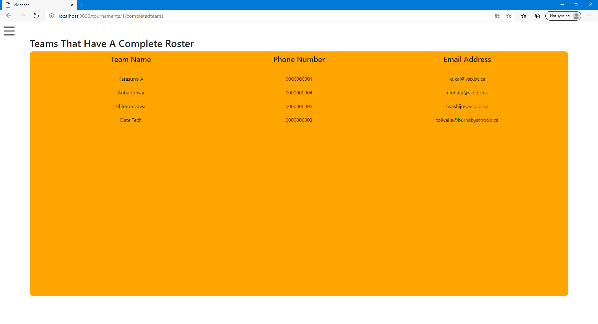

## Nested Aggregation with Group By
Highlights the team(s) that participated in the most tournaments
### Before
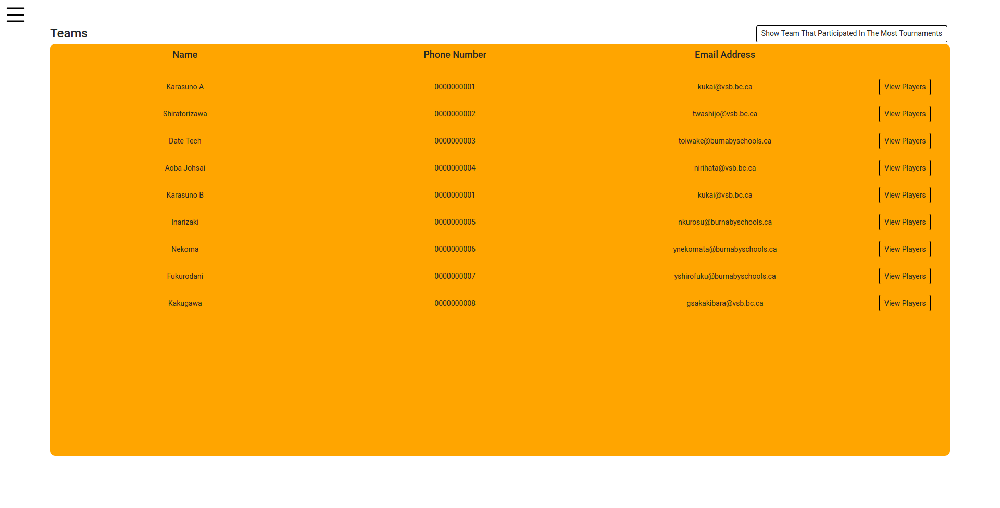
### After
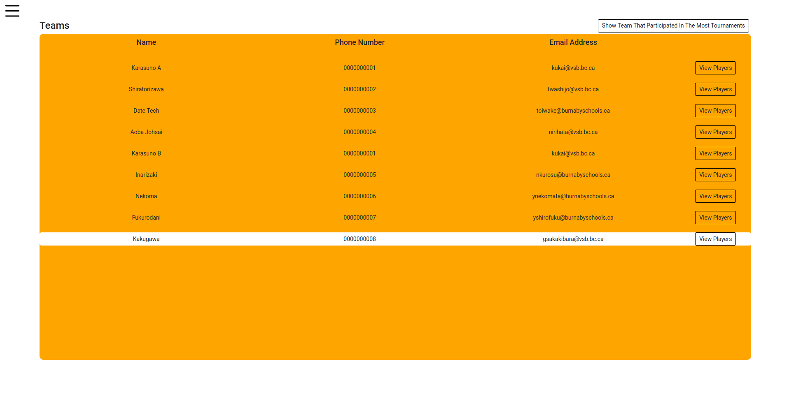

## Division
Select players that played in all selected tournaments
### Before
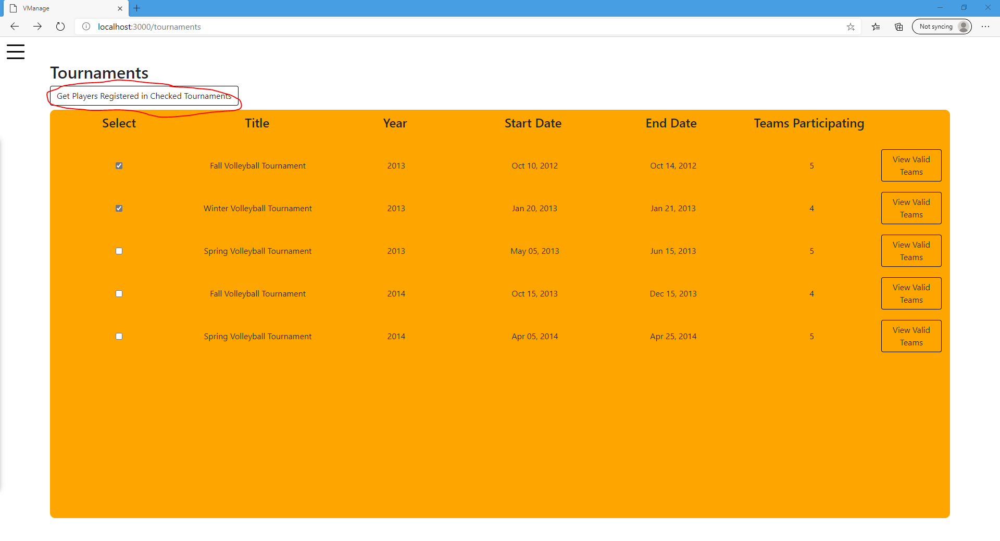
### After
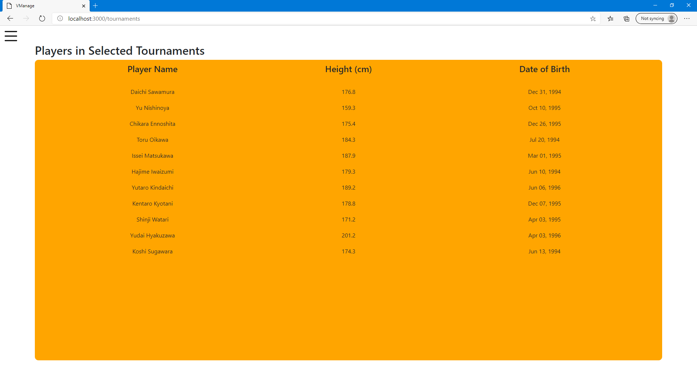
